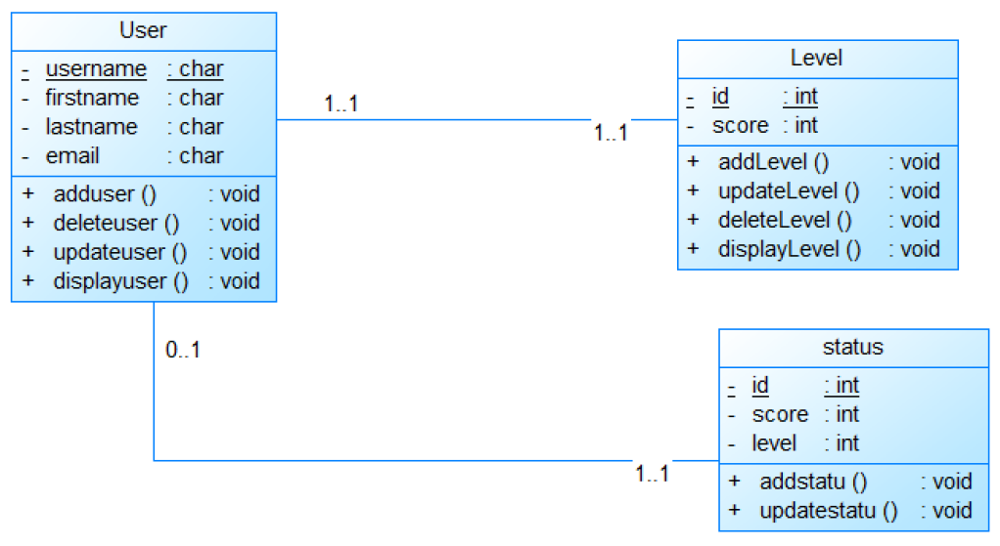

# Tetriste Game - Mini Project Report

## Table of Contents
1. [📖 Introduction](#introduction)
2. [🎮 Features](#features)
3. [🛠️ Technologies Used](#technologies-used)
4. [📥 Installation](#installation)
5. [🎲 How to Play](#how-to-play)
6. [📊 Class Diagram](#class-diagram)
7. [🎥 Demo Video](#demo-video)
8. [🏁 Conclusion](#conclusion)

---

## 📖 Introduction
This project, titled **Tetriste**, is a mini-game developed as part of the **Data Structures** course for the academic year 2023/2024. The game is designed to challenge players to create repeated patterns using colored and shaped pieces. The project was developed using **C++** and incorporates advanced data structures such as linked lists to manage game pieces and their interactions.

The game features user authentication, a dynamic game board, and various functionalities such as piece insertion, shifting, and chaining. The project also includes a scoring system, saving/loading game states, and a leaderboard for top scores.

---

## 🎮 Features
### User Functionalities
- **👤 Registration and Login**: Users can register and log in to save their progress and scores.
- **🧩 Piece Insertion**: Players can insert randomly generated pieces onto the game board.
- **🔄 Shifting**: Players can shift pieces based on their shape or color to create patterns.
- **⛓️ Chaining**: Pieces are linked using circular linked lists for efficient management.
- **🏅 Scoring System**: Points are awarded for creating patterns, with bonus points for using shifts.
- **⛔ Game Over**: The game ends after 15 pieces are placed on the board.
- **💾 Save/Load**: Players can save their progress and resume later.
- **🏆 Leaderboard**: The top 10 scores are saved and displayed.

### Admin Functionalities
- **👨‍💻 User Management**: Admins can manage user accounts and game data.
- **🗃️ Database Management**: Admins can view and manage game data stored in the database.

---

## 🛠️ Technologies Used
- **💻 Programming Language**: C++
- **🗄️ Database**: SQL Server
- **🔧 Development Environment**: Visual Studio 2017
- **📐 Modeling Tool**: PowerDesigner
- **🔄 Version Control**: Git

---

## 📥 Installation
1. **📂 Clone the Repository**:
   ```bash
   git clone https://github.com/your-repo/tetriste-game.git
   ```
2. **🚪 Open the Project**:
   - Open the project in **Visual Studio 2017**.
3. **🔨 Build the Project**:
   - Build the solution to compile the game.
4. **▶️ Run the Game**:
   - Execute the compiled binary to start the game.

---

## 🎲 How to Play
1. **👤 Register/Login**: Create an account or log in to an existing one.
2. **🎮 Start Game**: Begin a new game or continue from a saved state.
3. **🧩 Insert Pieces**: Place randomly generated pieces on the board.
4. **🔄 Shift Pieces**: Use the shift functionality to rearrange pieces based on shape or color.
5. **🎯 Create Patterns**: Form repeated patterns to score points.
6. **💾 Save Progress**: Save your game state to continue later.
7. **🏆 View Leaderboard**: Check the top scores after completing the game.

---

## 📊 Class Diagram
Below is the class diagram for the Tetriste game, illustrating the relationships between the main classes and their attributes/methods.



---

## 🎥 Demo Video
A demonstration of the game's interfaces and functionalities can be found in the video below:

[](https://www.youtube.com/watch?v=your-video-id)

---

## 🏁 Conclusion
The **Tetriste** project was an excellent opportunity to apply data structure concepts, particularly linked lists, in a practical and engaging way. The game not only provides entertainment but also serves as a learning tool for understanding complex data management techniques. Future improvements could include enhanced graphics, multiplayer functionality, and additional game modes.


This concludes the **Tetriste** mini-project report. Thank you for your interest and support! 🎉
